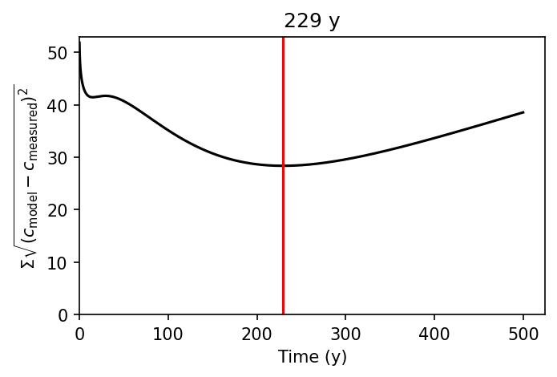
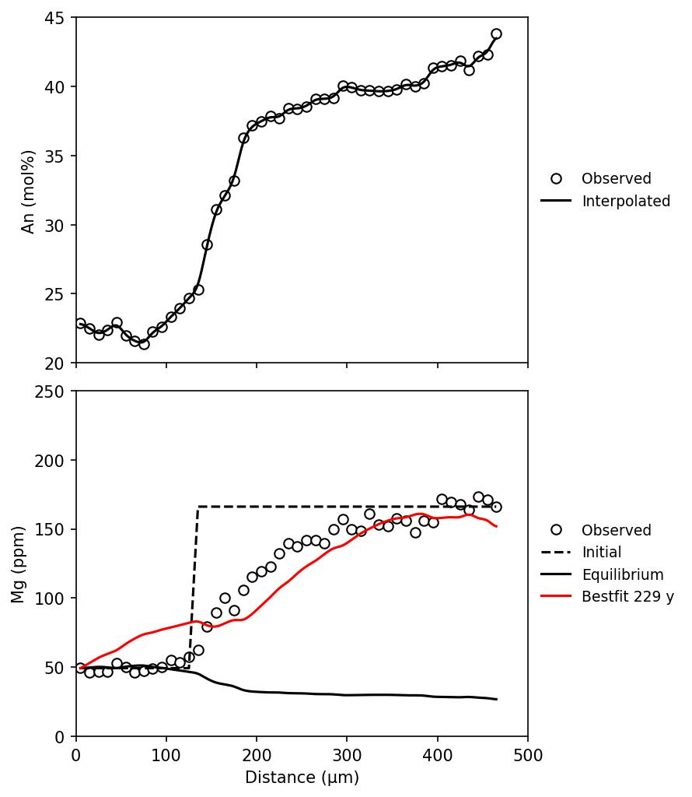

# diffusion-chronometry-plagioclase

**diffusion-chronometry-plagioclase** is a repository for carring out diffusion chronometry of plagioclase.

## Available models and parameters
This repository encompasses the diffusion chronometry of Mg and Sr in plagioclase utilizing Equation 7 from Costa et al. (2003). The diffusion equation is discretized in space and time, and it is numerically solved using the finite-difference forward method. Boundary conditions can be selected from the Dirichlet boundary condition (fixed value) and the Neumann boundary condition ($\mathrm{d}u/\mathrm{d}x = 0$).

This repository contains the following partition coefficients and diffusion coefficients:
- Mg, Partition coefficient: Mutch et al. (2022), Diffusion coefficient: LaTourrette and Wasserburg (1998); Costa et al. (2003); Van Orman et al. (2013)
- Sr, Partition coefficient: Bindeman et al. (1998), Diffusion coefficient: Giletti and Casserly (1994)

## Rerequistes
The repository relies on the following third-party libraries:
- `Numpy`: carrying out numerical calculations
- `Pandas`: loading input files
- `Matplotlib`: visualisation of the calculation results
- `tqdm`: displaying calculation progress

The easiest way to install third-party libraries is by running `pip install --user $(library_name)`.

## Usage
1. (optional) `interpolation.py` linearly interpolate analysed data. To execute the calculation, the input compositional data should be analysed at equal intervals. If you only have non-equal interval data, this program should be used.
1. `preprocessor.py` calculates equilibrium composition from the rim composition and diffusion coefficient at each point.
1. (optional) `calcparam.py` estimate thermodynamic parameter ($A$ in equation 7 of Costa et al. (2003)). If you apply the Mg partition coefficient of Mutch et al. (2022) to numerical modelling, slope of partition coefficient that is described as $RT\ln{K_D} = AX_\mathrm{An} + B$ from analysed An content and melt SiO2 content.

1. `diffmodel.py` solves the diffusion equation using the finite-difference forward method.
1. `fitting.py` searches the best-fit time from modelling results.

1. `plotter.py` plots modelling results.

## About `config.json`
The setting parameters are consolidated in the `config.json`.

- `Working directory`: Directory name for saving a input file (`input.csv`), temporary files (e.g. `interpolated.csv`), and output images (e.g. `img.jpg`).
- `T (C)`: Surrounding melt temperature as degree Celsius
- `melt SiO2 (wt%)`: (optional) Surrounding melt SiO2 content (wt%). This parameter is only required for the partition coefficient of Mutch et al. (2022).
- `Element`: Element `"Mg"`, `"Sr"`, `"Ti"`, `"Ba"`.
- `Partition coefficient`:
  - `"Mutch2022"` (Mutch et al., 2022): `"Mg"`, `"Ti"`, `"Sr"`, `"Ba"`
  - `"Nielsen2017"` (Nielsen et al., 2017): `"Mg"`
  - `"Bindeman1998"` (Bindeman et al., 1998): `"Mg"`, `"Sc"`, `"Ti"`, `"Rb"`, `"Sr"`, `"Ba"`
  - `"Blundy1991"` (Blundy & Wood, 1991): `"Sr"`, `"Ba"`
  - `"Drake1972"` (Drake et al., 1972): `"Sr"`, `"Ba"`
- `Diffusion coefficient`:
  - Mg: `"Costa2003"` (Costa et al., 2003) or `"VanOrman2014"` (Van Orman et al., 2014)
  - Sr: `"Zellmer1999"` (Giletti & Casserly, 1994; Zellmer et al., 1999)
  - Ti: `"Cherniak2020"` (Cherniak and Watson, 2020)
- `Time unit`: `"hour"`, `"day"`, `"year"`
- `A (J)`: Slope of RTlnKD vs XAn. This parameter is only required for the partition coefficient of Mutch et al. (2022).
- `distance step (um)`: Interval of distance for interpolation.
- `Max time`: maximum time at set time unit
- `Boundary condition`: `"Neuman"` (du/dx = 0) or `"Dirichlet"` (fix)
- `xlim`: `[minimum, maximum]`
- `ylim`: `[minimum, maximum]`
- `xlabel`: Label of x-axis.
- `ylabel`: Label of y-axis.
- `Bestfit index`: Index of bestfit results by using `fitting.py`.
- `Image format`: Format of output images (e.g. `"jpg"`, `"tif"`).

## References
- Bindeman, I., Davis, A., Drake, M., 1998. Ion microprobe study of plagioclase-basalt partition experiments at natural concentration levels of trace elements. Geochimica et Cosmochimica Acta, 62, 1175-1193. https://doi.org/10.1016/S0016-7037(98)00047-7
- Blundy, J., Wood, B., 1991. Crystal-chemical controls on the partitioning of Sr and Ba between plagioclase feldspar, silicate melts, and hydrothermal solutions. Geochimica et Cosmochimica Acta, 55, 193-209. https://doi.org/10.1016/0016-7037(91)90411-W
- Cherniak, D., Watson, E., 2020. Ti diffusion in feldspar. American Mineralogist, 105, 1040-1051. https://doi.org/10.2138/am-2020-7272
- Costa, F., Chakraborty, S., Dohmen, R., 2003. Diffusion coupling between trace and major elements and a model for calculation of magma residence times using plagioclase. Geochimica et Cosmochimica Acta, 67, 2189-2200. https://doi.org/10.1016/j.epsl.2018.03.043
- Giletti, B., Casserly, J., 1994. Strontium diffusion kinetics in plagioclase feldspars. Geochimica et Cosmochimica Acta, 58, 3785-3793. https://doi.org/10.1016/0016-7037(94)90363-8
- Nielsen, R., Ustunisik, G., Weinsteiger, A., Tepley III, F., Johnston, A., Kent, A., 2017. Trace element partitioning between plagioclase and melt:An investigation of the impact of experimental and analyticalprocedures. Geochemistry, Geophysics, Geosystems, 18, 3359-3384. https://doi.org/10.1002/2017GC007080
- Mutch, E., Maclennan, J., Madden-Nadeau, A., 2022. The dichotomous nature of Mg partitioning between plagioclase and melt: Implications for diffusion chronometry. Geochimica et Cosmochimica Acta, 339, 173–189. https://doi.org/10.1016/j.gca.2022.10.035
- Van Orman, J., Cherniak, D., Kita, N., 2013. Magnesium diffusion in plagioclase: Dependence on composition, and implications for thermal resetting of the 26Al–26Mg early solar system chronometer. Earth and Planetary Science Letters, 385, 79-88. https://doi.org/10.1016/j.epsl.2013.10.026

## License
The repository is **not confidential** and available under the [MIT license](https://opensource.org/license/mit/).